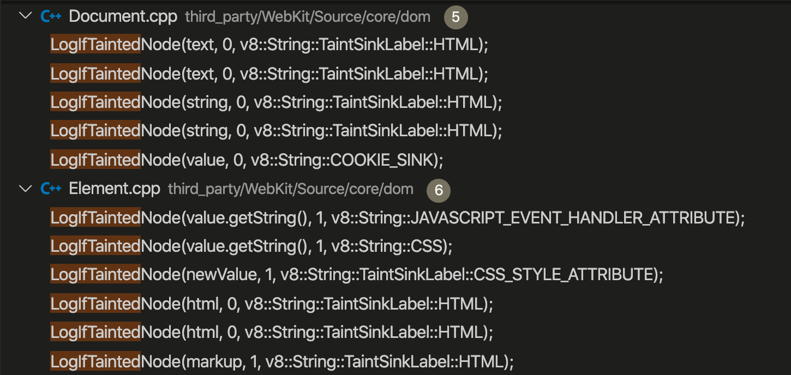
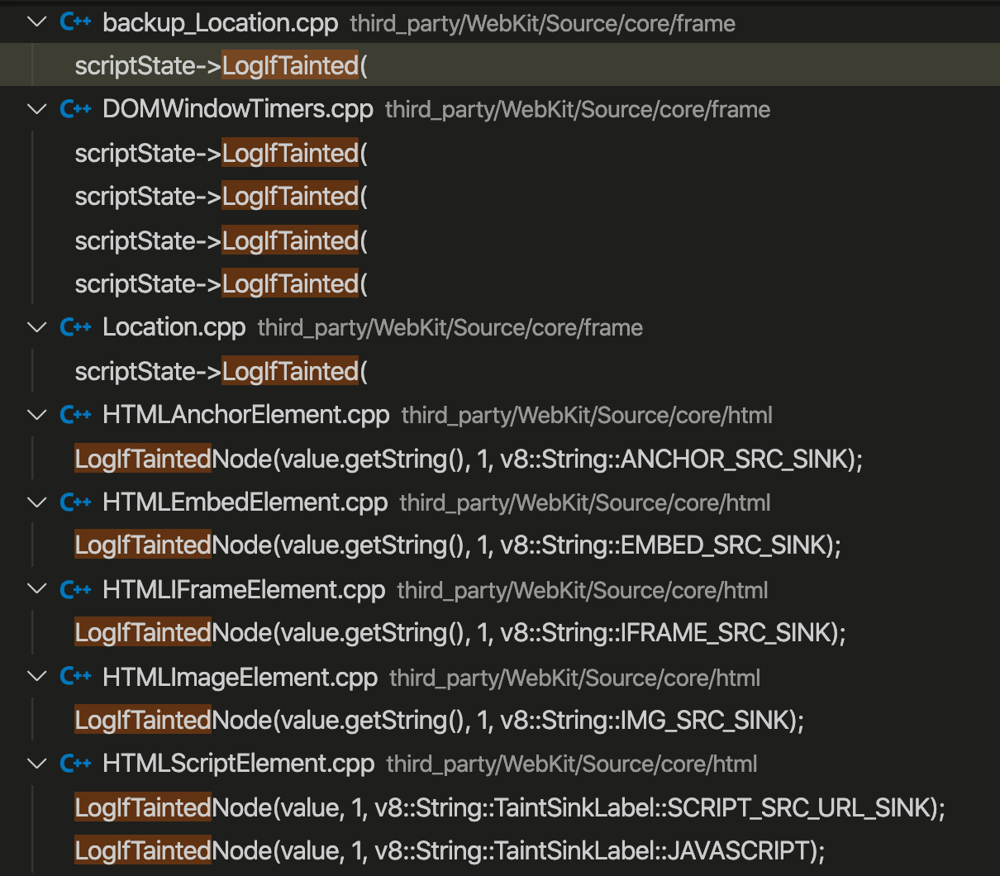

# Codes for taint processing

## 1.file usage

- `/exploit`: records about exploits (use different urls) and proper results in records
- `filter_log.py`: codes about filting log files
- `filter_record.py`: codes about filting record files
- `filter_log.cpp`: codes for filting log files (cpp edition) (Errors detected, checking...)
- `pair.py`: codes about pairing the log file results (filtered) with record (not filtered)
- `trans2js.py`: codes about transmition from log filter results to javascript codes

```python
# source & output file path need be changed inside the python files`
run: python xxx.py
```

## 2.Comments adding
- `Element.cpp`: changes for elements + changes for css style + setInnerHTML + setOuterHTML
- `Document.cpp`: document.write+setCookie...changes about web document 
- `.Location.cpp&backup_location.cpp`: changes for position 
- `DOMWindowTimes.cpp`: settimeout+settimeinterval
- `HTMLAnchorElement.cpp&...Embeded...&...Frame...&...Image...&...script....cpp`: changes for web func listener
- `runtime-compiler.cc`: eval function




